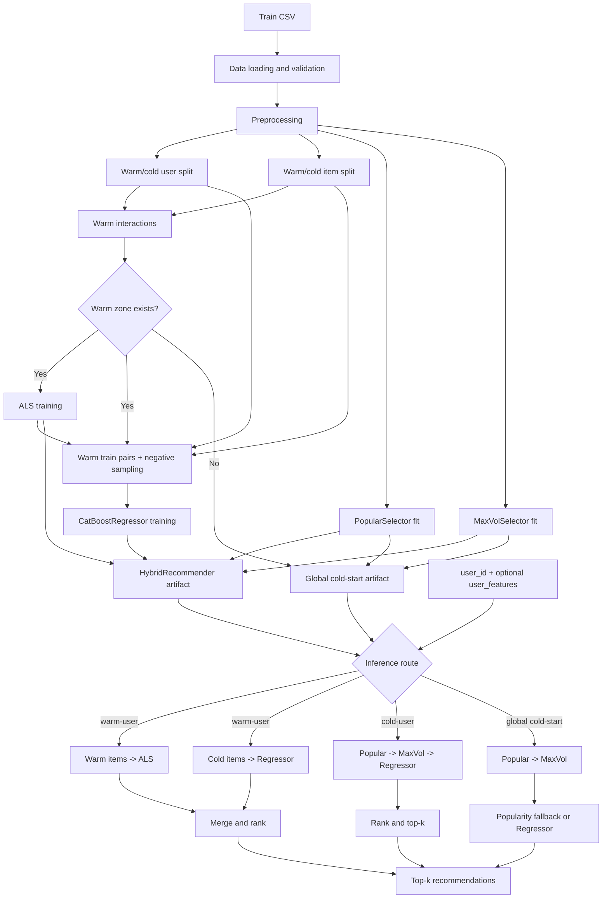

# RecSys Cold Start

Репозиторий объединяет несколько реализаций рекомендательной системы для cold-start сценариев.

Сейчас в нём есть три основные ветки работы:

- [cold-item](/Users/kite/RecSys_cold_start/cold-item/README.md) — текущий baseline для `cold-item`
- [cold-item-ranker-only-experiment](/Users/kite/RecSys_cold_start/cold-item-ranker-only-experiment/README.md) — экспериментальная retrieval + ranking версия
- [cold-user](/Users/kite/RecSys_cold_start/cold-user/README.md) — текущая реализация unified `warm-user / cold-user / global cold-start`

## Текущее состояние

### `cold-item`

Это baseline-ветка, которая была оставлена как основа после сравнения с экспериментальной версией.

Ключевая идея:

- `ALS`
- `CatBoostRegressor`
- инференс по внешнему candidate pool:
  - `candidate_pairs.csv`

### `cold-item-ranker-only-experiment`

Это исследовательская версия, в которой retrieval и ranking были разделены сильнее:

- support pool через `popular + maxvol`
- synthetic vectors для cold items
- `CatBoostRanker`

Эта версия сохранена в репозитории как экспериментальная и документированная причина, почему от неё отказались как от основной. При этом часть её кода была переиспользована позже в `cold-user`, в частности:

- `popular_selector`
- `maxvol_selector`

### `cold-user`

Это текущая production-like ветка для нового сценария.

Она не просто добавляет новый cold-user flow, а объединяет в себе:

- логику `cold-user`
- логику `global cold-start`
- и базовую идею `cold-item` baseline

Поддерживаются:

- `warm-user`
- `cold-user`
- `global cold-start`

Основной inference здесь уже работает по:

```text
user_id
optional user_features
top_k
```

а не через внешний candidate pairs CSV.

## Как устроен pipeline `cold-user`



## Структура репозитория

```text
RecSys_cold_start/
├── README.md
├── Datasets/
│   └── README.md
├── cold-item/
│   └── README.md
├── cold-item-ranker-only-experiment/
│   └── README.md
├── cold-user/
│   ├── README.md
│   ├── config.py
│   ├── main_train.py
│   ├── main_infer.py
│   └── src/
│       ├── als_model.py
│       ├── cold_user_recommender.py
│       ├── data_loader.py
│       ├── feature_builder.py
│       ├── hybrid_recommender.py
│       ├── inference_pipeline.py
│       ├── maxvol_selector.py
│       ├── popular_selector.py
│       ├── preprocessing.py
│       ├── regressor_model.py
│       ├── split_warm_cold.py
│       ├── split_warm_cold_users.py
│       ├── train_pipeline.py
│       └── utils.py
└── tests/
    └── README.md
```

## Что использовать сейчас

Если нужно:

- посмотреть baseline cold-item решение:
  - использовать `cold-item/`

- посмотреть отвергнутую experimental retrieval + ranking версию:
  - использовать `cold-item-ranker-only-experiment/`

- работать с новой unified логикой для пользователей:
  - использовать `cold-user/`

Все три ветки можно отдельно запускать и тестировать.

Но если говорить о наиболее полной и конечной на текущий момент версии, то ей является:

- `cold-user/`

Потому что именно она сейчас объединяет:

- warm-user flow
- cold-user flow
- global cold-start fallback
- и часть логики baseline cold-item подхода

## Датасеты и тесты

- описание датасетов: [Datasets/README.md](/Users/kite/RecSys_cold_start/Datasets/README.md)
- структура папки с экспериментами и тестовыми результатами: [tests/README.md](/Users/kite/RecSys_cold_start/tests/README.md)
