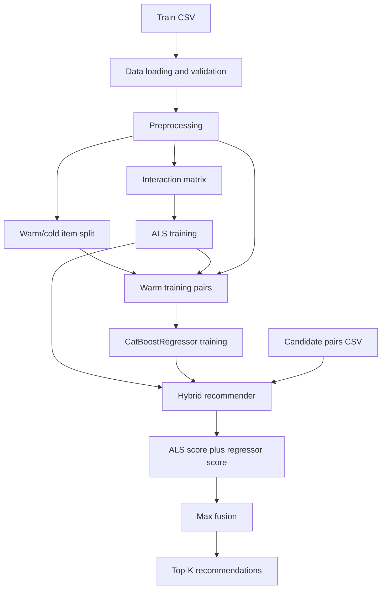

# RecSys Cold Start

Проект по гибридным рекомендательным системам для двух сложных cold-start сценариев:

- `cold-item` — рекомендации для новых или редких объектов;
- `cold-user` — рекомендации для новых пользователей с недостаточной историей.

Репозиторий задуман как общий каркас для нескольких направлений исследования, где коллаборативные методы, feature-based модели и стратегии генерации кандидатов объединяются в один воспроизводимый pipeline.

## Что уже есть в репозитории

- `cold-item/` — реализованный модуль гибридной рекомендации на базе `ALS + CatBoostRegressor`;
- `cold-user/` — зарезервированное направление под отдельный модуль решения cold-user задачи;
- `Datasets/` — описание используемых датасетов и внешних источников;
- `tests/` — папка для результатов экспериментов, сравнений и артефактов запусков.

## Задача проекта

Цель проекта — построить гибридную рекомендательную систему, которая умеет работать там, где чистая коллаборативная фильтрация начинает терять качество:

- когда у товара мало или почти нет взаимодействий;
- когда пользователь новый и его поведение ещё не накоплено;
- когда нужно объединять поведенческий сигнал, признаки сущностей и эвристики генерации кандидатов.

Проект полезен как исследовательская и инженерная база для задач:

- recommendation systems;
- cold-start handling;
- ranking and reranking;
- candidate generation;
- гибридизации collaborative и feature-based подходов.

## Архитектура репозитория

```text
RecSys_cold_start/
├── README.md
├── Datasets/
│   └── README.md
├── cold-item/
│   ├── README.md
│   ├── main_train.py
│   ├── main_infer.py
│   └── src/
│       ├── data_loader.py
│       ├── preprocessing.py
│       ├── split_warm_cold.py
│       ├── als_model.py
│       ├── feature_builder.py
│       ├── ranker_model.py
│       ├── hybrid_recommender.py
│       ├── train_pipeline.py
│       └── inference_pipeline.py
├── cold-user/
└── tests/
    └── README.md
```

## Направление `cold-item`

Это текущая реализованная часть проекта.

### Идея

Для сценария `cold-item` используется гибридный подход:

1. `ALS` обучается на матрице взаимодействий `user-item`;
2. items делятся на `warm` и `cold` по популярности;
3. для warm-пар считается `ALS score`;
4. `CatBoostRegressor` обучается приближать этот `ALS score` по признакам пользователя и объекта;
5. на инференсе для пары `(user, item)` считаются оба score:
   - `als_score`
   - `regressor_score`
6. итоговый скор задаётся как:

```text
final_score = max(als_score, regressor_score)
```

Такой подход позволяет использовать collaborative signal там, где он уже есть, и одновременно опираться на признаки там, где взаимодействий мало.

### Как устроен pipeline



### Что делает реализация

`cold-item/` уже содержит полноценный train/inference pipeline:

- `data_loader.py` — загрузка CSV и валидация обязательных колонок;
- `preprocessing.py` — нормализация `user_id/item_id`, построение user/item feature tables, `SimpleImputer + StandardScaler + OneHotEncoder`;
- `split_warm_cold.py` — разделение объектов на `warm` и `cold` по `count` или `value_sum`;
- `als_model.py` — построение sparse-матрицы и обучение `implicit` ALS;
- `feature_builder.py` — подготовка обучающих пар для CatBoost и negative sampling по warm items;
- `ranker_model.py` — feature-based модель `CatBoostRegressor`;
- `hybrid_recommender.py` — объединение ALS и регрессора в одну систему;
- `train_pipeline.py` / `inference_pipeline.py` — полный сценарий обучения и применения;
- `main_train.py` / `main_infer.py` — CLI-точки входа.

### Формат входных данных

Для обучения `cold-item` модуль ожидает CSV как минимум с колонками:

- `user_id`
- `item_id`
- `value`

Дополнительно поддерживаются признаки:

- `user_*` — признаки пользователя;
- `item_*` — признаки объекта.

Для инференса обязателен CSV с candidate pairs:

- `user_id`
- `item_id`

### Пример запуска

Обучение:

```bash
python cold-item/main_train.py \
  --train-csv path/to/train.csv \
  --model-output artifacts/hybrid_model.joblib
```

Инференс:

```bash
python cold-item/main_infer.py \
  --model-path artifacts/hybrid_model.joblib \
  --input-csv path/to/candidate_pairs.csv \
  --top-k 10
```

## Направление `cold-user`

Папка `cold-user/` в корне уже зарезервирована под отдельный модуль с похожей структурой, как у `cold-item/`, но с логикой под новый тип cold-start проблемы: новые пользователи без достаточной истории взаимодействий.

### Планируемая идея

Для `cold-user` направления предполагается использовать гибрид:

- `Top Popular Items` — базовая генерация кандидатов для пользователей без истории;
- `Maximum Volume Algorithm` — отбор/diversification репрезентативного набора кандидатов;
- `CatBoost` — feature-based reranking по пользовательским и товарным признакам;
- `ALS` — подключение collaborative signal там, где по пользователю уже появляется история.

### Предполагаемая логика pipeline

1. определить, является ли пользователь cold-user;
2. сгенерировать базовый candidate pool из top-popular items;
3. сократить и разнообразить кандидатов через `Maximum Volume Algorithm`;
4. собрать признаки пользователя и объектов;
5. применить `CatBoost` для reranking;
6. если по пользователю уже доступен достаточный сигнал, использовать `ALS` как дополнительный скоринг-компонент;
7. объединить score и вернуть итоговый ranking.

### Планируемая структура

Ожидается похожая модульная организация:

```text
cold-user/
├── README.md
├── main_train.py
├── main_infer.py
└── src/
    ├── data_loader.py
    ├── preprocessing.py
    ├── top_popular.py
    ├── maxvol_selector.py
    ├── als_model.py
    ├── ranker_model.py
    ├── hybrid_recommender.py
    ├── train_pipeline.py
    └── inference_pipeline.py
```

Сейчас этот модуль ещё не реализован, но root-репозиторий уже организован так, чтобы оба направления жили в одной общей структуре и сравнивались между собой.

## Технологии

В текущем проекте используются:

- `Python`
- `pandas`
- `scipy.sparse`
- `scikit-learn`
- `implicit` ALS
- `CatBoost`
- `joblib`
- `Jupyter Notebook` и CSV-ориентированный workflow для экспериментов

## Датасеты

Описание датасетов вынесено в [Datasets/README.md](/Users/kite/RecSys_cold_start/Datasets/README.md).

Сейчас в проектном контуре описаны датасеты для:

- recommendation systems;
- customer behavior analysis;
- predictive marketing;
- fashion recommendation, включая `H&M Personalized Fashion Recommendations`.

## Эксперименты и тесты

Папка [tests/README.md](/Users/kite/RecSys_cold_start/tests/README.md) описывает рекомендуемую структуру для хранения результатов запусков.

Идея простая: один эксперимент — одна отдельная подпапка с:

- `recommendations.csv`
- `scored_pairs.csv`
- `metrics.csv`
- графиками, скриншотами и короткими заметками

Это нужно для удобного сравнения разных fusion-стратегий, моделей и cold-start подходов.

## Что даёт этот проект

Репозиторий полезен как практическая база для изучения и разработки:

- гибридных рекомендательных систем;
- cold-item и cold-user сценариев;
- feature engineering для user/item пар;
- генерации кандидатов и reranking;
- модульных ML-pipeline с отдельными train/infer сценариями.

По сути, это не один узкий ноутбук-эксперимент, а каркас для серии рекомендательных подпроектов, которые можно расширять, сравнивать и постепенно доводить до production-like архитектуры.
